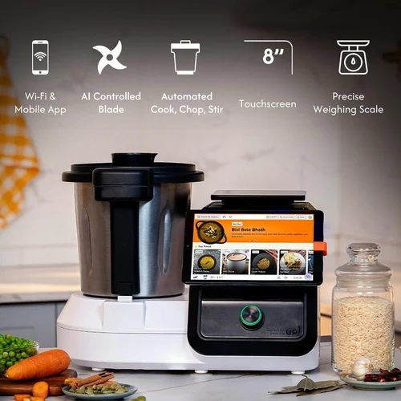

# Yumazing: Your AI Cooking Assistant, Amplified by Avalanche 🍽️🥣



**Yumazing** is an advanced AI Cooking Assistant that integrates seamlessly with the **Avalanche L1 blockchain** to create a rewarding, transparent, and community-driven culinary ecosystem.

## Demo Video

<!-- TODO: Add link to product demo video -->
[Watch the Product Demo Here!](https://www.example.com/your-demo-video)

## The Intelligent Cooking Assistant (Core Product)

At its heart, Yumazing is a sophisticated cooking assistant designed to elevate your kitchen experience:

*   **AI-Powered Recipe Guidance**: Access a vast library of recipes, enjoy personalized meal planning, and follow step-by-step interactive cooking instructions.
*   **Automated Cooking (with compatible hardware)**: For users with compatible smart kitchen appliances, Yumazing can take control of processes like chopping, sautéing, simmering, and maintaining precision temperatures.
*   **Generative AI for Culinary Creativity ("YumAI")**:
    *   Create brand-new recipes based on ingredients you have on hand.
    *   Adapt existing recipes to meet specific dietary needs (e.g., vegan, gluten-free, low-carb).
    *   Get instant answers to your cooking-related questions.
*   **Personalized User Profiles**: Yumazing learns your taste preferences, dietary restrictions, allergies, and cooking habits over time to provide an increasingly tailored experience.

## The Problem We Solve

Current smart cooking assistants offer a degree of recipe guidance and automation, but they often lack:

*   **Deeper User Engagement**: Beyond simple instruction following, there's little to keep users truly invested.
*   **True User Ownership**: Users contribute their time and effort but don't have a tangible stake or ownership in the platform's content or success.
*   **Community & Recognition**: The culinary experience is often solitary, with limited avenues for sharing, recognition, or collaborative improvement.

## Our Solution: Blockchain-Enhanced Culinary Experience

By integrating with the Avalanche blockchain, Yumazing transforms from a standalone assistant into an interactive platform, unlocking tangible economic and social benefits for its users.


## Avalanche L1 Integrated Features (The "Yumazing Ecosystem")

### 1. Cook-to-Earn with Yum Tokens (YUM) 💰
*   **Verified Cooking**: Your Yumazing Assistant verifies when you successfully cook registered community recipes or achieve personal cooking goals.
*   **Automated Rewards**: Smart contracts on Avalanche automatically reward you with Yum Tokens (YUM) directly to your integrated wallet.

### 2. NFT Recipe Cards & Culinary Achievements 🏆
*   **Own Your Creations**: Culinary creators using the Yumazing Assistant to develop original recipes can mint them as unique Non-Fungible Tokens (NFTs) on Avalanche.
*   **Royalties**: Earn passive income in Yum Tokens when other users cook your NFT-gated recipe via their Yumazing Assistant.
*   **Digital Culinary Trophies**: The Assistant tracks your cooking journey, and you earn unique, verifiable Achievement Badges (NFTs) for milestones like "Master of Sourdough," "Weekly Meal Prep Champion," or "Sustainable Chef."

### 3. Decentralized Community Recipe Treasury (YumDAO) 🗳️
*   **Community Governance**: Yum Token holders govern a Decentralized Autonomous Organization (DAO) that curates, validates, and promotes the best community-submitted recipes accessible through the Yumazing Assistant.
*   **Quality & Variety**: The Assistant prominently features top DAO-approved recipes, ensuring a high standard and diverse selection for all users.

### 4. YumTrace: Blockchain-Verified Food Supply Chain (Future Integration) 🥕
*   **Transparency**: The Yumazing Assistant can integrate with YumTrace, a system potentially built on an Avalanche Subnet.
*   **Ingredient Journey**: Scan QR codes on partnered ingredients, and your Assistant displays their immutable journey on the blockchain (origin, certifications, handling).
*   **Verified Ingredients**: Recipes within the Assistant can highlight "YumTrace Verified" ingredients, enhancing consumer trust.
*   **Bonus Rewards**: Potential for bonus Yum Token rewards when your Assistant logs the use of these transparently sourced ingredients.

### 5. Incentivized Engagement & Feedback ⭐
*   **Valuable Feedback**: Your Assistant facilitates rating and reviewing recipes. Earn Yum Tokens for providing valuable feedback, processed via smart contracts.
*   **Challenges & Competitions**: Participate in cooking challenges and competitions run through the platform, with rewards distributed on Avalanche.

### Yum Token Utility (Within the Assistant & Ecosystem)
*   **Governance**: Vote on YumDAO proposals directly via an interface in your Yumazing Assistant.
*   **Premium Access**: Unlock exclusive recipes, advanced YumAI features, or personalized consultations with culinary experts.
*   **Staking**: Stake Yum Tokens for additional rewards and to support the network's operations and security.
*   **Marketplace**: Buy, sell, or trade Recipe NFTs and other culinary digital collectibles within the Yumazing ecosystem.

## Why Avalanche L1 for Your Cooking Assistant? 🏔️

Avalanche provides the ideal blockchain infrastructure to support and enhance the Yumazing Cooking Assistant:

*   **Speed & Scalability**: Ensures real-time reward distribution, instant NFT minting confirmations, and smooth handling of numerous micro-transactions as users interact with their Assistants and the ecosystem. This is crucial for a seamless user experience.
*   **Customizability with Subnets**: This is a cornerstone advantage.
    *   **Yumazing Core Subnet**: Can be dedicated to the primary application logic of the Assistant's on-chain interactions (tokens, recipe NFTs, core DAO functions). This allows for custom gas parameters (potentially using Yum Tokens for fees) and optimized performance tailored to the Assistant's needs.
    *   **YumTrace Subnet (Optional but Recommended)**: Can handle the potentially high-throughput data from the supply chain component without impacting the performance of the main application subnet.
*   **Low Transaction Costs (Gas Fees)**: Makes micro-rewards and frequent on-chain interactions (like rating a recipe or completing a simple cooking task) economically feasible and user-friendly.
*   **Robust Smart Contract Capabilities**: Essential for executing the complex logic of Cook-to-Earn, NFT ownership and royalties, DAO governance, and YumTrace verification.
*   **Interoperability (Avalanche Warp Messaging - AWM)**: Future-proofs the ecosystem, allowing for potential connections to other food-tech platforms, DeFi applications for Yum Token holders, or other relevant Avalanche subnets.
*   **Eco-Friendly Consensus (Proof-of-Stake)**: Aligns with modern expectations for sustainable technology, an important factor for a consumer-facing product.

### Customizable Subnets: The "Yumazing Chain" Advantage

Launching Yumazing's core on-chain functionalities on a dedicated **Avalanche Subnet** (your "Yumazing Chain") offers the best of both worlds – public blockchain benefits with private chain-like control and performance:

*   **EVM Compatibility (Subnet EVM)**:
    *   Utilize Solidity, the most widely-adopted smart contract language.
    *   Leverage the extensive ecosystem of Ethereum developer tools (e.g., Hardhat, Remix, OpenZeppelin).
    *   Access a large pool of experienced blockchain developers.
    *   Ensure easier interoperability with other EVM-based assets and applications.
*   **Dedicated Throughput & Performance**: Your Yumazing Subnet has its own resources. Its performance and transaction speeds are not affected by congestion on the Avalanche Primary Network or other subnets. This is critical for a responsive and reliable AI Cooking Assistant.
*   **Custom Gas Fees & Fee Token**:
    *   Define your own fee model for the Yumazing Subnet.
    *   **Use Yum Tokens for gas fees**, creating intrinsic demand and utility for your native token.
    *   Implement very low fees to encourage interaction or even subsidize transactions initially to drive adoption.
*   **Controlled Validator Set (Optional - PoA like characteristics)**:
    *   While subnets can be permissionless, you have the flexibility to define specific requirements for entities wishing to validate your subnet (e.g., staking a certain amount of YUM Tokens, meeting specific hardware specifications).
    *   For components like YumTrace, you could even have a more controlled (permissioned-like) validator set where, for instance, only certified food suppliers or auditors initially validate supply chain data. This allows for a Proof of Authority (PoA)-style model for parts of the ecosystem where specific trust and accountability are paramount.
*   **Application-Specific Optimization**: The subnet can be tailored precisely to the needs of the Yumazing Cooking Assistant and its on-chain features, ensuring efficient operation.

This customized "Yumazing Chain" (as an Avalanche Subnet) is ideal for a sophisticated consumer application, providing the security and interoperability of Avalanche with the performance and control needed for a seamless user experience.

## Technical Architecture: Cooking Assistant Meets Avalanche


*Note: Replace with an actual architecture diagram if available.*

### 1. The Yumazing AI Cooking Assistant (Hardware/Software)
*   The user-facing device (if hardware-based) or application (if software-based).
*   Manages user accounts, recipe display, AI functionalities (YumAI), and cooking process control (if applicable).
*   Securely communicates with a dedicated Avalanche Wallet integrated or linked by the user.
*   Contains modules to trigger or report actions to the blockchain layer (e.g., recipe completion confirmation, ingredient scan for YumTrace).

### 2. Avalanche L1 Integration Layer (Yumazing Core Subnet)
*   **Smart Contracts (Solidity, deployed on the Subnet EVM)**:
    *   `YumToken.sol`: ERC20-compliant fungible token for rewards and utility.
    *   `RecipeNFT.sol`: ERC721 or ERC1155 contract for unique recipe cards.
    *   `AchievementNFT.sol`: ERC721 or ERC1155 for culinary achievement badges.
    *   `CookToEarnOracle.sol`: A smart contract (or set of contracts) that listens to data from authenticated Yumazing Assistants. This may involve a trusted oracle system if direct device-to-chain communication is too complex or poses security risks. Its role is to verify cooking events.
    *   `RewardDistribution.sol`: Handles the logic for issuing Yum Tokens and NFTs based on verified actions reported by the `CookToEarnOracle`.
    *   `YumDAO.sol`: Manages DAO proposals, voting, and treasury for community recipes.
*   **(Optional) YumTrace Subnet Smart Contracts**:
    *   Contracts for product identity, track-and-trace functionality, and supplier/certifier verification.

### Data Flow Example (Cook-to-Earn with Assistant):
1.  **Recipe Selection**: User selects a DAO-verified recipe on their Yumazing Assistant.
2.  **Cooking Process**: The Assistant guides the user, and/or automates cooking steps (if hardware compatible).
3.  **Completion & Verification**: Upon successful completion (verified by the Assistant's internal logic, sensors, or user confirmation), the Assistant sends a secure, signed message.
4.  **Oracle Interaction**: This message is sent to the `CookToEarnOracle` contract on the Yumazing Subnet (potentially via an intermediary oracle service for security and scalability, which then posts the verified data on-chain).
5.  **Reward Trigger**: The `CookToEarnOracle` validates the message and triggers the `RewardDistribution` contract.
6.  **Token/NFT Distribution**: The `RewardDistribution` contract mints/transfers Yum Tokens and/or an Achievement NFT to the user's linked Avalanche wallet.
7.  **UI Update**: The user sees their new rewards reflected in their Yumazing Assistant interface and their Avalanche wallet.

## 🚀 Getting Started with the Yumazing App (Current Build)

This repository contains the Expo (React Native) application for the Yumazing Cooking Assistant.

### Prerequisites
*   Node.js (LTS version recommended)
*   Expo CLI: `npm install -g expo-cli`
*   An Avalanche-compatible wallet (e.g., Core Wallet, MetaMask configured for Avalanche C-Chain) for interacting with blockchain features.

### How to Run
1.  **Clone the repository:**
    ```sh
    git clone <your-repo-url>
    cd yumazing-app 
    ```
2.  **Install dependencies:**
    ```sh
    npm install 
    # or
    yarn install
    ```
3.  **Set up Environment Variables:**
    Create a `.env` file in the root of the project and add your Supabase and other necessary credentials:
    ```
    SUPABASE_URL=your_supabase_url
    SUPABASE_ANON_KEY=your_supabase_anon_key
    # Add other environment variables if needed
    ```
4.  **Start the development server:**
    ```sh
    npx expo start
    ```
    This will open the Expo developer tools in your browser. You can then:
    *   Scan the QR code with the Expo Go app on your iOS or Android device.
    *   Press `a` to run on an Android emulator/device.
    *   Press `i` to run on an iOS simulator/device (macOS only).
    *   Press `w` to run in the web browser.

### Scripts
*   `npm start` or `yarn start`: Starts the Expo development server.
*   `npm run android` or `yarn android`: Starts the app on a connected Android device or emulator.
*   `npm run ios` or `yarn ios`: Starts the app on an iOS simulator or connected device (macOS only).
*   `npm run web` or `yarn web`: Runs the app in a web browser.

## Database Seeding (Optional)
If you need to populate your Supabase database with initial recipe data:
```sh
bun run src/db/seed.ts recipes
bun run src/db/seed.ts exclusiveRecipes 
# or to seed all
bun run src/db/seed.ts 
```

## 🛠️ Built With
*   **React Native**
*   **Expo & Expo Router**
*   **Tailwind CSS (NativeWind)**
*   **Supabase (PostgreSQL)** - Backend for recipe data
*   **Drizzle ORM** - For database schema and queries
*   **Avalanche** - For blockchain-based rewards, NFTs, and DAO (future full integration)

## 🔮 Next Steps & Considerations (Focusing on the Integrated Product)

*   **Cooking Assistant Core Development**: Continue refining the core features and capabilities of the AI cooking assistant itself (hardware and/or software).
*   **Seamless Wallet Integration**: The user experience for interacting with the blockchain (wallet setup, transaction signing) must be incredibly simple and ideally abstracted away within the Assistant's interface. Consider SDKs like AvalancheJS or Web3Modal.
*   **Oracle Design for Assistant Data**: Determine the most secure, scalable, and cost-effective way to get cooking completion data from potentially millions of Assistants onto the blockchain for reward verification. This is a critical trust point. Research decentralized oracle networks (e.g., Chainlink, Pyth) or custom solutions.
*   **API Design**: Robust APIs for communication between the Assistant application, the blockchain (via the Subnet), and potentially third-party robot hardware if your assistant is primarily software-based.
*   **User Onboarding & Education**: Develop a clear and engaging onboarding process that introduces users to the blockchain aspects and their benefits without overwhelming them.
*   **Value Proposition Clarity**: Continuously refine and clearly articulate why a blockchain-enhanced cooking assistant is superior to a non-connected one, focusing on user benefits.
*   **Security Audits**: Once smart contracts are developed, thorough security audits are essential.
*   **Community Building**: Start fostering a community around Yumazing, engaging potential users and recipe creators.

By centering the "Cooking Assistant" and using Avalanche L1 (specifically, a custom Subnet) to unlock a new dimension of rewards, ownership, community, and transparency, the Yumazing concept is powerfully positioned at the intersection of smart home technology, AI, and Web3.

---

_This README provides an overview of the Yumazing project, its vision, and technical considerations. For specific details on development and contributions, please refer to relevant documentation within the repository._
